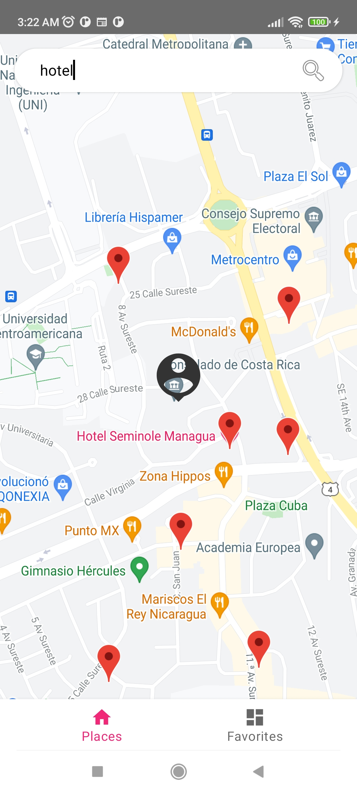

# App to search places

Application made natively with kotlin in which the google places API is consumed to bring places of interest to the user

## Features

- Search places based on a location selected on map and on a keyword given by the user
- See the list of places
- Go to the details view when tap a marker on the map
- In Details screen you can save as favorite the place you are watching
- You can see the places that you save in the tab "favorites"


## Tech

Dillinger uses a number of open source projects to work properly:

- [Framework Android]
- [Retrofit] - awesome library to make http request
- [GSON] - Library to convert JSON to Objects.
- [Navigation Component] - It helps us to implement navigation between screens in our apps
- [Room] - Room is a persistence library that provides an abstraction layer over SQLite
- [RecyclerView] - To show collection of data (reviews and favorites places)
- [LiveData] - Observable data holder class and lifecycle aware
- [ViewModel] - To store UI related data
- [DataBinding] - To bind UI components in your layouts to data sources in your app using a declarative format rather than programmatically

## Requirements

- [Git](https://git-scm.com/) - Git is a free and open source distributed version control system designed to handle everything from small to very large projects with speed and efficiency.
- [Java](https://www.java.com/en/) - Java is a programming language and computing platform first released by Sun Microsystems in 1995. Install Java 8 and Java 11.
- [Android Studio](https://developer.android.com/studio) - Android Studio provides the fastest tools for building apps on every type of Android device. Version Bumblebee | 2021.2.1 Patch 1.

## screenshots





## Installation

Clone the repository.

```bash
git clone https://github.com/NYK0de/Places.git
git status
```

You have to install Java 8 and Java 11.

Install Android Studio and then open the project...
Only need to execute the run button and will build the project satisfactory.

Or if you want to build and install via terminal, this are steps:

> Note: Set `Java 11` is required for execute gradle tools.
> Note: The `Physical Device` have to have configure the [Developer Options, Debugging USB](https://developer.android.com/studio/debug/dev-options) and connected the device to laptop.

On Mac or Linux
```bash
./gradlew installDebug
```

On Windows
```bash
gradlew.bat installDebug
```